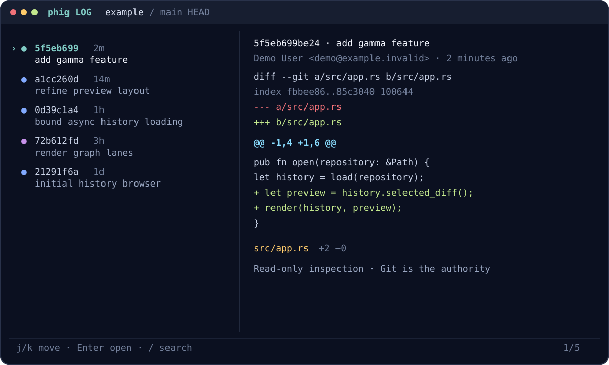

<div align="center">

# phig

**Git history at the speed of thought.**

A fast, focused terminal browser for commits, diffs, refs, files, blame, stashes,
and clean human-to-agent handoff. The indispensable part of tig, rebuilt for
modern terminals without becoming a Git dashboard.

[](https://github.com/phall1/phig/actions/workflows/ci.yml)
[](https://github.com/phall1/phig/releases/latest)
[](#license)

[Install](#install) · [Quick start](#quick-start) · [Keys](#keys) ·
[Agent and phux workflows](#agent-and-phux-workflows) · [Configuration](docs/configuration.md) ·
[Reference](docs/reference.md)

</div>



## Why phig

- **Immediate.** Run `phig`; history appears with an asynchronous diff preview.
- **Diff-first.** Move through commits, files, hunks, parents, and blame without
  losing context.
- **Honest comparisons.** Merge-base branch comparisons and exact endpoint
  diffs are distinct commands and visibly labeled.
- **Complete inspection.** Browse refs, worktree/index status, revision trees,
  blobs, line blame, and stashes from one dominant surface.
- **Composable.** Return a commit, ref, file, hunk, line, or comparison through
  stdout, or emit bounded deterministic `phig/1` JSON snapshots.
- **Safe by design.** Version 1 is read-only. Git stays authoritative; phig
  disables prompts, hooks, pagers, external diff drivers, and lazy fetching.

## Install

Phig supports macOS 12+ and glibc-based Linux/WSL (glibc 2.31+) on x86-64 and
ARM64. It requires Git 2.45.1 or newer. musl-native and native Windows are not
supported in version 1.

### Homebrew

```sh
brew install phall1/tap/phig
```

### Shell installer

```sh
curl --proto '=https' --tlsv1.2 -LsSf \
  https://raw.githubusercontent.com/phall1/phig/main/install.sh | sh
```

The installer fetches a versioned cargo-dist installer, which verifies the
release archive's SHA-256 checksum. Pin a release or choose a prefix when needed:

```sh
curl --proto '=https' --tlsv1.2 -LsSf \
  https://raw.githubusercontent.com/phall1/phig/main/install.sh -o /tmp/phig-install.sh
PHIG_VERSION=1.0.0 sh /tmp/phig-install.sh --prefix "$HOME/.local" --yes
```

### Cargo

Once the release is published and verified on crates.io:

```sh
cargo install phig-cli --locked
```

Verify any installation with `phig version`. See the complete
[installation, update, verification, and uninstall guide](docs/installation.md).

## Quick start

```sh
phig                         # exactly phig log HEAD
phig log main                # browse another revision
phig show HEAD~3             # inspect one commit
phig compare main            # merge-base(main, HEAD) → HEAD
phig diff v1.0.0 HEAD -- src # exact endpoints, path-filtered
phig refs                    # branches, remotes, and tags
phig status                  # worktree and index changes
phig tree HEAD               # revision tree and blobs
phig blame HEAD -- src/lib.rs
phig stash                   # stash entries and patches
```

No configuration is required. `phig config init` writes a documented config to
`$XDG_CONFIG_HOME/phig/config.toml` (normally `~/.config/phig/config.toml`).

## Keys

| Key | Action | Key | Action |
| --- | --- | --- | --- |
| `j` / `k`, arrows | move | `Enter` | open |
| `q` / `Esc` | back or quit | `/`, `n` / `N` | search, next/previous |
| `g` / `G` | first/last | `[` / `]` | previous/next hunk |
| `Tab` | change focus | `P` | next parent |
| `f` | filter/jump changed files | `y` | copy with OSC 52 |
| `v` | mark endpoint | `c` | compare marked/current |
| `:` | command palette | `?` | contextual help |

The footer is always the local source of truth. Documented semantic navigation
and view actions are remappable; see [configuration](docs/configuration.md).

## Agent and phux workflows

`select` uses `/dev/tty` for its UI while stdout contains exactly one result, so
command substitution remains clean:

```sh
hunk="$(phig select --kind hunk --format json HEAD)"
printf '%s\n' "$hunk" | jq .

commit="$(phig select --kind commit --format oid)"
git show --stat "$commit"
```

Snapshots are bounded, non-interactive, byte-clean, and paginated explicitly:

```sh
phig snapshot status | jq '.payload.data'
phig snapshot --offset 100 log HEAD | jq .
phig version --json
```

For phux, tmux, or preserved scrollback:

```sh
phig --no-alt-screen refs
```

Phig does not embed an agent, daemon, or network service. See the
[composability contract](docs/COMPOSABILITY.md) and checked-in
[`phig/1` schema](docs/schema/phig-1.schema.json).

## Updates

Updates are always explicit and are the only normal phig operation that uses the
network:

```sh
phig update --check
phig update
```

Canonical Homebrew installations delegate to `brew upgrade phig`. Other
installations stage the checksummed cargo-dist result beside the destination,
verify the exact version, and atomically replace the old executable with rollback
protection. Failures return exit code 6 without reporting success.

## Documentation

- [Installation and updates](docs/installation.md)
- [Configuration](docs/configuration.md)
- [CLI, machine protocol, and exit codes](docs/reference.md)
- [Interaction design](docs/UX.md)
- [Security model](docs/SECURITY.md)
- [Architecture](docs/ARCHITECTURE.md)
- [Release process and provenance](docs/release.md)
- [Performance](docs/performance.md)

## Scope

Phig is an interactive Git lens, not a Git IDE. Version 1 deliberately does not
stage, commit, checkout, rebase, merge, push, run repository commands, or embed
AI. It invokes the installed Git CLI and therefore inherits Git's repository
format and platform behavior. Layout may evolve while the stable CLI,
configuration semantics, exit codes, semantic actions, and `phig/1` protocol
remain compatible.

## Contributing

See [CONTRIBUTING.md](CONTRIBUTING.md). Security issues belong in
[private vulnerability reporting](https://github.com/phall1/phig/security/advisories/new),
not a public issue.

## License

Licensed under either [Apache License 2.0](LICENSE-APACHE) or
[MIT](LICENSE-MIT), at your option.
